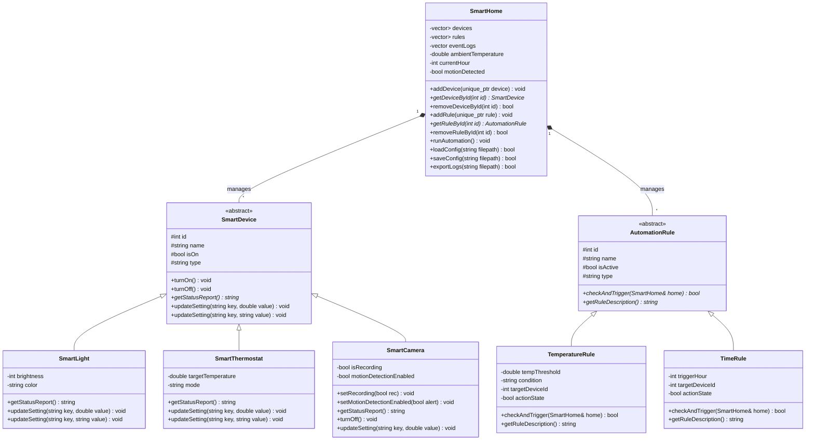

# 🏠 智慧家居自動化系統 (Smart Home Automation System)

本專案是一個基於 C++ 實作的終端機智慧家居模擬與自動化系統。利用物件導向程式設計（OOP）的特型（如類別繼承、多型、STL 容器管理），提供使用者在文字介面下控制各種智慧裝置、模擬環境參數，並自訂與執行自動化規則。

---

## 🚀 核心功能特色

1. **多型智慧設備管理**：
   - 支援三種智慧設備：**燈光 (SmartLight)**、**溫控器 (SmartThermostat)**、**安全相機 (SmartCamera)**。
   - 設備基於 `SmartDevice` 抽象基類，各自擁有特有的設定方法與狀態回報格式。
2. **自動化規則引擎**：
   - 支援**溫度感應規則 (TemperatureRule)**：當環境溫度高於或低於指定閥值時，自動控制設備。
   - 支援**時間觸發規則 (TimeRule)**：當系統模擬時間到達特定小時數時，自動控制設備。
   - 規則繼承自 `AutomationRule` 抽象類別，支援動態啟用/停用。
3. **環境參數模擬**：
   - 使用者可以任意修改環境參數，包括**溫度**、**系統時間 (0-23)** 與**動態感測**。
   - 每當手動控制或環境模擬變更時，系統會自動輪詢所有啟用中的自動化規則，進行連動觸發。
4. **資料持久化與日誌**：
   - **配置存取**：支援將當前所有智慧設備與規則的狀態序列化存儲至 `config.txt`，並在啟動時自動載入。
   - **日誌導出**：系統運行的每個操作與規則觸發皆會記錄，使用者可將這些日誌導出為 CSV 檔案。
5. **跨平台防呆與編碼**：
   - 終端機輸入均有類型與範圍驗證（輸入非數字會要求重新輸入）。
   - 在 Windows 環境下啟動時，會自動調用 API 設定控制台代碼頁為 UTF-8，以防止中文字元亂碼。

---

## 📊 系統架構設計 (Class Diagram)

本系統完全採用 C++ 物件導向架構，以下是核心類別的繼承與關聯結構：



---

## 🔄 系統執行流程 (System Workflow)

整個程式的核心是一個交互式的 Dashboard 輪詢迴圈。下圖展示了主迴圈流程，以及當使用者做出操作或修改環境時，自動化引擎（Automation Engine）的觸發機制：

```mermaid
flowchart TD
    Start([啟動程式]) --> InitWindows[Windows 主機自動初始化 UTF-8]
    InitWindows --> LoadConfig[自動嘗試讀取 config.txt]
    LoadConfig --> MainLoop[顯示中控面板 Dashboard]
    
    MainLoop --> ShowStats[顯示環境狀態、設備列表、自動化規則]
    ShowStats --> ShowMenu{使用者主選單選擇}
    
    ShowMenu -->|1. 控制設備| CtrlDevice[選擇設備 ID 並更新狀態與數值]
    ShowMenu -->|2. 模擬環境參數| SimEnv[修改室內溫度 / 系統時間 / 動態感測]
    ShowMenu -->|3. 管理設備| ManageDev[新增或移除智慧設備]
    ShowMenu -->|4. 管理規則| ManageRules[新增 / 移除 / 啟停自動化規則]
    ShowMenu -->|5. 儲存設定| SaveConf[將當前狀態寫入 config.txt]
    ShowMenu -->|6. 載入設定| LoadConf[手動讀取 config.txt 配置]
    ShowMenu -->|7. 匯出日誌| ExpLogs[將快取日誌寫出為 CSV 檔]
    ShowMenu -->|8. 結束程式| ExitSys([結束系統])
    
    CtrlDevice --> AutoTrigger[執行自動化規則輪詢]
    SimEnv --> AutoTrigger
    ManageDev --> AutoTrigger
    ManageRules --> AutoTrigger
    SaveConf --> MainLoop
    LoadConf --> MainLoop
    ExpLogs --> MainLoop
    
    subgraph 自動化規則引擎 (Automation Engine)
        AutoTrigger --> LoopRules[遍歷所有已啟用的 AutomationRule]
        LoopRules --> CheckCond{判斷環境變數是否達到門檻?}
        CheckCond -->|是| TargetState{目標設備目前開關狀態與規則是否不同?}
        CheckCond -->|否| NextRule[檢查下一條規則]
        TargetState -->|不同| TriggerAction[控制設備開關並記錄 Log]
        TargetState -->|相同| NextRule
        TriggerAction --> NextRule
        NextRule --> LoopRules
    end
    
    LoopRules -->|遍歷完成| MainLoop
```

---

## 🛠️ 開發環境與建置說明

### 先決條件
- 支援 C++14 或更高版本的 C++ 編譯器（如 `g++` 或 MSVC）

### 編譯指令
在專案根目錄下，開啟終端機並執行以下指令進行編譯：

```bash
# 使用 g++ 編譯專案所有來源檔案
g++ -std=c++14 -o smart_home src/*.cpp
```

### 執行程式
```bash
# 執行編譯後的程式
./smart_home
```

---

## 📁 專案檔案結構

* `src/` - 系統主要 C++ 程式碼
  * `SmartDevice.h` - 智慧設備多型基底類別
  * `SmartLight.h`、`SmartThermostat.h`、`SmartCamera.h` - 各式智慧設備衍生類別
  * `AutomationRule.h` - 自動化規則多型基底類別
  * `TemperatureRule.h`、`TimeRule.h` - 各式自動化規則衍生類別
  * `SmartHome.h`、`SmartHome.cpp` - 智慧家居中控核心，管理所有設備、規則、檔案讀寫與日誌
  * `main.cpp` - 互動式文字介面、輸入防呆驗證與系統主迴圈
* `config.txt` - 保存設備與規則配置的文字檔
* `openspec/` - OpenSpec 自動化工具設計規格文件
